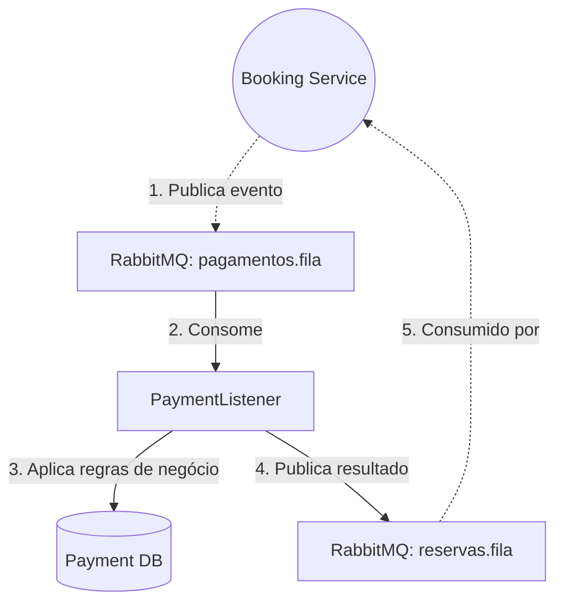

# Payment Service 💳🎬


> **ℹ️ Nota do Desenvolvedor:** Este projeto foi desenvolvido com fins educacionais e para composição de portfólio. O objetivo é demonstrar padrões de arquitetura de microserviços, processamento assíncrono (workers) e arquitetura orientada a eventos (Event-Driven Architecture).

Parte do ecossistema **Cinema Microservices**, o `payment-service` atua em background como um worker — ouvindo eventos de novas reservas e simulando a aprovação ou recusa de pagamentos. Veja também o serviço parceiro: [`booking-service`](https://github.com/ArturRossiJunior/booking-service).

> **⚠️ Dependência de Infraestrutura:** Este serviço **não gerencia sua própria infraestrutura**. O PostgreSQL e o RabbitMQ são provisionados pelo `docker-compose.yml` localizado na raiz do [`booking-service`](https://github.com/ArturRossiJunior/booking-service). Suba a infraestrutura daquele projeto antes de iniciar este.

---

## 🏆 Principais Tecnologias & Aprendizados

> Este projeto foi construído com foco no aprofundamento prático nas três tecnologias abaixo, que representam pilares fundamentais do desenvolvimento backend moderno.

| Tecnologia | Papel no Projeto | Conceitos Aplicados |
|---|---|---|
| 🐳 **Docker & Docker Compose** | A infraestrutura (PostgreSQL + RabbitMQ) é provisionada pelo `booking-service` e consumida por este serviço — demonstrando containers compartilhados entre serviços distintos. | Isolamento de containers, banco de dados dedicado por serviço (`payment_db`), redes Docker compartilhadas. |
| 🐇 **RabbitMQ** | Canal principal de comunicação do worker. | Consumers/Listeners (`@RabbitListener`), processamento reativo de mensagens, publicação de respostas em fila, desacoplamento. |
| 🧩 **Microserviços** | Serviço autônomo com uma única responsabilidade: processar pagamentos. Escala e falha de forma independente. | Database-per-Service, Event-Driven Architecture, contratos tipados com Enums, trilha de auditoria distribuída. |
| 🧪 **Testes Automatizados** | Garantia de que a regra de negócio do worker nunca quebre, rodando isolada. | Mocks (Mockito), Isolamento de Banco (H2 Database), Testes de Controladores e Listeners Assíncronos. |
| 🤖 **CI/CD (GitHub Actions)** | Automação da esteira de integração contínua. | Actions trigam a cada *push*, rodando os testes e buildando a imagem Docker automaticamente. |
| ☁️ **Deploy em Nuvem (Railway)** | Hospedagem em produção como worker contínuo. | Execução em background (*worker process*) sem domínio público. Docker Multi-stage Build otimizado. Integração via variáveis de ambiente com o RabbitMQ em nuvem. |

---

## 🏗️ Arquitetura e Papel no Sistema

Este serviço expõe endpoints HTTP via REST, porém sua comunicação entre as outras peças do ecossistema acontece de forma reativa e autônoma através do **RabbitMQ**: ele consome eventos de pagamento em background e publica os resultados de volta.



## 🚀 Tecnologias Utilizadas

| Tecnologia | Versão | Uso |
|---|---|---|
| Java | 17 | Linguagem principal |
| Spring Boot | 4.0.6 | Data JPA, AMQP |
| PostgreSQL | 16 | Banco de dados isolado (`payment_db`) |
| Flyway | — | Migrations para criação da tabela de pagamentos |
| RabbitMQ | 3 | Mensageria assíncrona |

## ☁️ CI/CD & Deploy na Nuvem (Railway)

Este microserviço está configurado com uma esteira completa de **Integração e Entrega Contínuas (CI/CD)**:

1. **Testes e Build:** Ao realizar um `push` na branch `main`, o **GitHub Actions** (`ci.yml`) assume o controle. Ele roda toda a suíte de testes automatizados e constrói a imagem da aplicação.
2. **Otimização (Docker Multi-stage):** O `Dockerfile` do projeto foi desenhado com o padrão *Multi-stage Build*, que separa o ambiente pesado de compilação do ambiente limpo de execução, resultando em uma imagem minúscula e super rápida para workers.
3. **Deploy Contínuo (Worker):** O Railway sincroniza automaticamente após o sucesso da pipeline. Por ser um *Event-Driven Worker*, o `payment-service` **não recebe uma URL pública** de domínio no Railway, operando exclusivamente no *backstage*, processando filas de forma segura.

## ⚙️ Como Executar Localmente

### 1. Pré-requisito — Subir a Infraestrutura

Na raiz do projeto `booking-service`, execute:

```bash
docker-compose up -d
```

> **💡 Painel do RabbitMQ:** Acesse `http://localhost:15672` (usuário: `guest` / senha: `guest`) e monitore a fila `pagamentos.fila` sendo consumida por este serviço em tempo real.

### 2. Configurando o Ambiente

Crie um arquivo `.env` na raiz **deste** projeto, usando o `.env.example` como base.

> **Nota:** Este serviço mapeia o banco `payment_db` na porta `5433` do localhost, garantindo isolamento total em relação ao banco do `booking-service` (porta `5432`).

```properties
DB_HOST=localhost
DB_PORT=5433
DB_NAME=payment_db
DB_USERNAME=postgres
DB_PASSWORD=sua_senha_aqui
```

### 3. Iniciando a Aplicação

```bash
./mvnw spring-boot:run
```

> **💡 IntelliJ IDEA:** Para usar o botão de "Run" da IDE, instale o plugin **EnvFile**. Nas configurações de execução (Run/Debug Configurations), acesse a aba "EnvFile", marque "Enable EnvFile" e adicione o arquivo `.env` do projeto.

---

## 🧠 Regras de Negócio

O `PaymentListener` escuta a fila `pagamentos.fila`. A decisão de aprovar ou recusar segue a tabela abaixo:

| Método de Pagamento | Valor | Resultado |
|---|---|---|
| `PIX` | Qualquer | ✅ **APROVADO** |
| Cartão / Outro | ≤ R$ 30,00 | ✅ **APROVADO** |
| Cartão / Outro | > R$ 30,00 | ❌ **RECUSADO** |

> **Nota de Implementação:** O limite de R$ 30,00 é definido como constante no código, não como valor hardcoded, facilitando alterações futuras.

Após processar a decisão, o serviço:
1. **Persiste** um registro de histórico (`Pagamento`) no `payment_db`.
2. **Publica** um `ConfirmacaoMessageDTO` na fila `reservas.fila` com o resultado (`APROVADO` ou `RECUSADO`).
3. O `booking-service` consome esse resultado e finaliza a reserva — liberando o assento em caso de recusa.

---

## 🛠️ Boas Práticas Aplicadas

- **Banco Isolado — Database per Service**
  O `payment-service` possui seu próprio banco PostgreSQL (`payment_db`), eliminando o acoplamento de dados com o `booking-service` (Database Coupling). Cada serviço é o único dono do seu esquema.

- **Arquitetura Orientada a Eventos — Event-Driven**
  O processamento assíncrono desacopla o fluxo de compra da latência do pagamento, permitindo que a API do `booking-service` responda instantaneamente e que ambos os serviços sejam escalados de forma completamente independente.

- **Tipagem Forte em Contratos de Mensageria**
  O uso de `Enums` (ex: `Status.APROVADO`) nos contratos da fila evita strings mágicas (`"APROVADO"`), garantindo *type-safety* em tempo de compilação e proteção contra quebras silenciosas ao renomear valores.

- **Trilha de Auditoria com Rastreabilidade Distribuída**
  O `usuarioId` é propagado desde o `booking-service` na mensagem de evento, permitindo rastrear de ponta a ponta quem originou cada transação financeira — uma prática essencial em sistemas distribuídos.

- **Migrations com Flyway**
  Criação e evolução do esquema de banco de dados de forma versionada e automatizada, eliminando dependência do `ddl-auto` do Hibernate e scripts manuais.

- **Padrão DTO com Java Records**
  O esquema de persistência (`Pagamento`) nunca é exposto diretamente como contrato da fila, isolando a camada de persistência da camada de mensageria e prevenindo acoplamento implícito.
